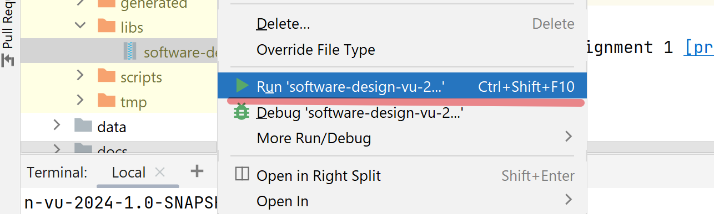

# Software Design 
This is the template for the team project of the Software Design course at the Vrije Universiteit Amsterdam. 

When submitting your project, remember to make a [GitHub release](https://docs.github.com/en/repositories/releasing-projects-on-github/managing-releases-in-a-repository) containing the fat Jar of your project in the `out` folder here. The fat Jar is the result of the full build of your project via Gradle.

For our project, it could run with the jar file from "build/libs/software-design-vu-2024-1.0-SNAPSHOT.jar". 

for assignment 1 [presentation link](https://docs.google.com/presentation/d/1WPon7IJvifMRLqSP--bVlCwAkMLeH5yF/edit#slide=id.g268e070e45b_2_17)
